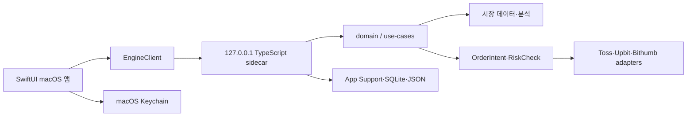

# YongStockDesk 이어서 개발하기

이 문서는 새 저장소에서 개발을 재개할 때 필요한 현재 상태와 안전 경계를 고정한다. 기능 제공 여부는 [현재 기능 문서](current-main-features.md), 세부 macOS 구조는 [네이티브 앱 문서](macos-native.md)를 함께 확인한다.

## 저장소 기준

| 항목 | 값 |
|---|---|
| 로컬 경로 | `/Volumes/WD_1TB/ForkDefault/YongStockDesk` |
| GitHub | `https://github.com/zamgune/YongDesk.git` |
| 기본 브랜치 | `main` |
| 패키지 도구 | Yarn `1.22.22` |
| macOS 요구 버전 | macOS 14 이상 |

제품과 저장소의 사용자 명칭은 `YongStockDesk`다. 이관 직후의 배포 호환성을 위해 런타임 이름은 아직 `StockAnalysis.app`, Swift 제품명은 `StockAnalysisMac`, 번들 ID는 `com.stockanalysis.mac`을 사용한다. 이 이름과 Keychain·App Support 경로는 별도 데이터 마이그레이션 없이 바꾸지 않는다.

## 개발 시작

```bash
cd /Volumes/WD_1TB/ForkDefault/YongStockDesk
yarn install --frozen-lockfile
yarn lint
yarn build
```

웹 관리·분석 화면은 다음 명령으로 실행한다.

```bash
yarn dev
```

macOS 앱을 검증하고 빌드하려면 다음 순서를 사용한다.

```bash
yarn mac:test
yarn mac:app
yarn mac:verify
yarn mac:verify:launch
```

생성된 앱은 `dist/macos/StockAnalysis.app`에 있으며 `dist/`, `.build/`, `.next/`, `.cache/`와 `node_modules/`는 커밋하지 않는다.

## 구조



- `apps/macos/StockAnalysisMac`: SwiftUI 앱, 메뉴바, Keychain, App Support와 로컬 앱 상태
- `scripts/local_engine.mts`: 앱이 자동으로 시작하는 로컬 HTTP sidecar
- `src/domain`, `src/use-cases`, `src/ports`: 거래·분석 규칙과 외부 경계
- `src/adapters`: Toss와 암호화폐 거래소 어댑터
- `src/app`: 웹 관리·분석 화면과 API route
- `tests`: 자동화, sidecar, Toss, 분석과 안전 정책 테스트

macOS 앱은 `apps/macos`만으로 독립되지 않는다. 빌드 스크립트가 루트의 `src`, `scripts`, `package.json`, `node_modules`와 Node 런타임을 앱 번들에 포함하므로 저장소 전체가 배포 소스다.

## 환경 변수와 인증정보

기존 StockAnalysis 저장소의 `.env.local`과 API 키는 새 저장소로 이관하지 않았다. 실제 값은 Git에 넣지 않는다.

웹·서버 기능을 사용할 때 필요한 대표 변수는 다음과 같다.

- `NEXT_PUBLIC_SUPABASE_URL`
- `NEXT_PUBLIC_SUPABASE_PUBLISHABLE_KEY`
- `SUPABASE_SECRET_KEY`
- `BROKER_CREDENTIAL_ENC_KEY`
- `AUTOMATION_BETA_INVITE_CODE`
- `CRON_SECRET`
- `ENABLE_LIVE_TRADING`
- `ENABLE_CRYPTO_LIVE_TRADING`

macOS 앱 사용자는 Toss 또는 거래소 키를 앱의 연결 화면에서 등록한다. 앱은 검증된 credential을 암호화 저장하고 암호화 키를 App Support와 Keychain 경계에서 관리한다. 로그, 리포트, 클립보드와 API 응답에는 client secret, access token, raw account number를 넣지 않는다.

## 거래 안전 경계

신호, 차트와 UI는 브로커를 직접 호출하지 않는다. 실제 주문은 항상 다음 경계를 통과해야 한다.

```text
전략 조건
→ OrderIntent 생성
→ RiskCheck
→ 검증된 credential
→ 자동화 계좌 선택
→ 운영자 live gate
→ 사용자 live gate
→ worker 상태
→ kill switch
→ 브로커 제출
```

- 실거래는 기본 OFF다.
- Toss 등록 성공은 시세·계좌 조회 준비일 뿐 실거래 활성화가 아니다.
- 시뮬레이션과 초안 저장은 주문 제출이나 자동화 시작이 아니다.
- 고정가·수익률 계산 결과는 호가 단위, 수수료, 슬리피지와 미체결 가능성을 통과하기 전까지 주문 가격이 아니다.
- 장기 종가 무효선은 일반 시장가 stop 주문으로 자동 변환하지 않는다.
- live gate가 열려 있어도 `RiskCheck` 실패와 kill switch가 주문을 차단해야 한다.

## 2026-07-10 검증 스냅샷

기준 소스 커밋은 `019c0e6`이다. 이후 문서만 바뀌었다면 아래 앱 검증 결과는 같은 소스에 대한 근거로 볼 수 있다.

| 검증 | 결과 |
|---|---|
| `yarn install --frozen-lockfile` | 통과 |
| `yarn lint` | 오류 0, 기존 경고 8 |
| `yarn build` | 통과, 기존 Turbopack NFT 추적 경고 1건 |
| `yarn test:automation` | 24건 통과 |
| `yarn test:local-engine` | 37건 통과 |
| `yarn test:toss` | 7건 통과 |
| `yarn mac:test` | Swift smoke test 통과 |
| `yarn mac:verify` | 앱 서명·번들 Node·sidecar 계약 통과 |
| `yarn mac:verify:launch` | 앱 실행·sidecar 자동 시작 통과 |
| beginner-first HTML | 주요 전략 흐름 클릭 및 1440/1024/736/320px 확인 |

이 결과는 로컬 ad-hoc 앱의 실행 가능성을 증명한다. 일반 사용자에게 경고 없이 배포할 수 있다는 뜻은 아니다. 공개 배포에는 Developer ID 서명, notarization, stapling과 실제 대상 Mac 검증이 추가로 필요하다.

Toss 실계좌 사용 가능 여부도 별도다. 사용자 credential 검증, 허용 IP, 자동화 계좌 선택과 두 live gate가 준비되기 전에는 실거래 준비 완료로 표시하지 않는다.

## 현재 우선순위

1. `beginner-first.html`의 Toss 필수 온보딩과 차트 중심 구조를 SwiftUI에 적용한다.
2. 주식 분봉과 암호화폐 WebSocket을 실제로 연결해 `1m·15m·1D`를 표시한다. 현재 UI의 주기 버튼을 실시간 차트로 표현하지 않는다.
3. 문장형 전략 조립기의 동적 분할차수, 직접 만들기와 반복 정책을 실제 전략 계약에 연결한다.
4. 단타·스윙·장기 익절·손절 계산 계약을 분석 엔진과 주문 적용 확인 단계에 연결한다.
5. 기능 안정화 후 YongStockDesk 런타임 이름과 기존 Keychain/App Support 데이터를 함께 마이그레이션한다.

UX 시안과 계산 명세가 있다고 실제 앱에 구현된 것으로 처리하지 않는다. 각 단계는 SwiftUI, sidecar 계약, 테스트와 배포 검증까지 완료된 뒤 현재 기능 문서의 상태를 갱신한다.

## 작업 마감 기준

- 사용자 기능 변경과 함께 현재 기능 문서를 갱신한다.
- sidecar endpoint를 바꾸면 네이티브 앱 문서와 `tests/local_engine.test.mts`를 함께 확인한다.
- 전략이나 신호 로직을 바꾸면 `STRATEGY_V2.md` 또는 해당 계산 명세를 갱신한다.
- 주문 경계를 바꾸면 자동화, Toss, risk policy 테스트를 모두 실행한다.
- macOS UI나 패키징을 바꾸면 `mac:test → mac:app → mac:verify → mac:verify:launch` 순서를 다시 통과한다.
- 커밋에는 관련 파일만 stage하고 `.env*`, 인증정보와 생성물을 포함하지 않는다.
