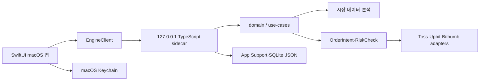

# YongStockDesk 이어서 개발하기

이 문서는 새 저장소에서 개발을 재개할 때 필요한 현재 상태와 안전 경계를 고정한다. 기능 제공 여부는 [현재 기능 문서](features.md), 세부 macOS 구조는 [네이티브 앱 문서](macos-native.md)를 함께 확인한다.

## 저장소 기준

| 항목 | 값 |
|---|---|
| 로컬 경로 | `/Volumes/WD_1TB/ForkDefault/YongStockDesk` |
| GitHub | `https://github.com/zamgune/YongDesk.git` |
| 기본 브랜치 | `main` |
| 패키지 도구 | Yarn `1.22.22` |
| macOS 요구 버전 | macOS 14 이상 |

제품과 저장소의 사용자 명칭은 `YongStockDesk`다. 이관 직후의 배포 호환성을 위해 런타임 이름은 아직 `StockAnalysis.app`, Swift 제품명은 `StockAnalysisMac`, 번들 ID는 `com.stockanalysis.mac`을 사용한다. 이 이름과 Keychain·App Support 경로는 별도 데이터 마이그레이션 없이 바꾸지 않는다.

## 개발 시작

```bash
cd /Volumes/WD_1TB/ForkDefault/YongStockDesk
yarn install --frozen-lockfile
yarn lint
yarn build
```

웹 관리·분석 화면은 다음 명령으로 실행한다.

```bash
yarn dev
```

macOS 앱을 검증하고 빌드하려면 다음 순서를 사용한다.

```bash
yarn mac:test
yarn mac:app
yarn mac:verify
yarn mac:verify:launch
```

생성된 앱은 `dist/macos/StockAnalysis.app`에 있으며 `dist/`, `.build/`, `.next/`, `.cache/`와 `node_modules/`는 커밋하지 않는다.

## 구조



- `apps/macos/StockAnalysisMac`: SwiftUI 앱, 메뉴바, Keychain, App Support와 로컬 앱 상태
- `apps/macos/StockAnalysisMac/Sources/StockAnalysisMac/BeginnerFirst`: 기본 차트·자산·전략·자동화·설정 workspace와 온보딩
- `scripts/local_engine.mts`: 앱이 자동으로 시작하는 로컬 HTTP sidecar
- `src/lib/local-engine/market-workspace.ts`: Toss·Yahoo·Upbit 멀티타임프레임 분석과 보유기간별 계획 조합
- `src/domain`, `src/use-cases`, `src/ports`: 거래·분석 규칙과 외부 경계
- `src/adapters`: Toss와 암호화폐 거래소 어댑터
- `src/app`: 웹 관리·분석 화면과 API route
- `tests`: 자동화, sidecar, Toss, 분석과 안전 정책 테스트

macOS 앱은 `apps/macos`만으로 독립되지 않는다. 빌드 스크립트가 루트의 `src`, `scripts`, `package.json`, `node_modules`와 Node 런타임을 앱 번들에 포함하므로 저장소 전체가 배포 소스다.

## 환경 변수와 인증정보

기존 StockAnalysis 저장소의 `.env.local`과 API 키는 새 저장소로 이관하지 않았다. 실제 값은 Git에 넣지 않는다.

웹·서버 기능을 사용할 때 필요한 대표 변수는 다음과 같다.

- `NEXT_PUBLIC_SUPABASE_URL`
- `NEXT_PUBLIC_SUPABASE_PUBLISHABLE_KEY`
- `SUPABASE_SECRET_KEY`
- `BROKER_CREDENTIAL_ENC_KEY`
- `AUTOMATION_BETA_INVITE_CODE`
- `CRON_SECRET`
- `ENABLE_LIVE_TRADING`
- `ENABLE_CRYPTO_LIVE_TRADING`

macOS 앱 사용자는 Toss 또는 거래소 키를 앱의 연결 화면에서 등록한다. Reddit OAuth는 뉴스·알림 화면에서 선택적으로 등록한다. 앱은 검증된 credential을 암호화 저장하거나 Keychain에 보관하며, 로그, 리포트, 클립보드와 API 응답에는 client secret, access token, raw account number를 넣지 않는다.

`ENABLE_LIVE_TRADING`과 `ENABLE_CRYPTO_LIVE_TRADING`은 웹·서버 또는 향후 실행 경계와의 호환을 위해 남아 있다. 데스크톱 1.0.0 앱은 두 값을 sidecar에 `false`로 전달하고, local engine도 Toss와 코인 live 제출을 별도 상수로 차단한다. 환경변수를 수동으로 `true`로 바꿔도 1.0.0 데스크톱 live 제출 준비 완료로 판정하지 않는다.

## 거래 안전 경계

신호, 차트와 UI는 브로커를 직접 호출하지 않는다. 아래 순서는 향후 실제 제출을 다시 열 때도 생략할 수 없는 계약이다. 데스크톱 1.0.0은 이 경계에 도달하기 전에 Toss와 코인 broker submit을 모두 차단한다.

```text
전략 조건
→ OrderIntent 생성
→ RiskCheck
→ 검증된 credential
→ 자동화 계좌 선택
→ 운영자 live gate
→ 사용자 live gate
→ worker 상태
→ kill switch
→ 브로커 제출
```

- 데스크톱 1.0.0은 주식과 코인 모두 paper-only다.
- Toss 등록 성공은 계좌·보유·미체결·주문 가능 정보 조회 준비이며 실거래 활성화가 아니다.
- Upbit·Bithumb 등록 성공은 잔고·주문 가능 정보·현재가·최소금액 점검 준비이며 실거래 활성화가 아니다.
- 시뮬레이션과 초안 저장은 주문 제출이나 자동화 시작이 아니다.
- 고정가·수익률 계산 결과는 호가 단위, 수수료, 슬리피지와 미체결 가능성을 통과하기 전까지 주문 가격이 아니다.
- 장기 종가 무효선은 일반 시장가 stop 주문으로 자동 변환하지 않는다.
- live gate가 열려 있어도 `RiskCheck` 실패와 kill switch가 주문을 차단해야 한다.

## 현재 검증 경로

Beginner-first SwiftUI, 멀티타임프레임 workspace와 보유기간별 계획은 코드와 결정론적 테스트에 연결돼 있다. 로컬 준비 게이트는 다음 명령으로 lint, build, sidecar, Toss·Upbit 공급자, metadata, horizon plan, paper 자동화와 Swift smoke를 순서대로 실행한다.

```bash
node --experimental-strip-types scripts/verify_desktop_readiness.mts --dry-run
node --experimental-strip-types scripts/verify_desktop_readiness.mts
```

`STOCK_ANALYSIS_MARKET_FIXTURE_MODE=1`은 네트워크·credential 없이 주식과 코인 workspace를 결정론적으로 검증하는 모드다. 응답이 fixture임을 명시하므로 실 API QA나 투자 판단에는 사용하지 않는다.

앱 번들과 패키지까지 포함하려면 `INCLUDE_MAC_BUNDLE=1`로 같은 readiness 스크립트를 실행한다. Beginner-first AX smoke와 arm64·x64 DMG 설치 검증의 1.0.0 기록은 [릴리스 이력](releases/v1.0.0.md)에 보존한다. 코드, UI smoke 또는 패키징 스크립트가 바뀌면 해당 기록을 현재 통과 증거로 재사용하지 말고 새 패키지에서 다시 생성한다. 실제 API 인수 절차와 기록 양식은 [데스크톱 실 API 인수 QA](desktop-live-api-qa.md)를 따른다.

## 현재 우선순위

1. 실제 Toss 키와 허용 IP로 `005930.KS`, `AAPL`의 1시간·일봉, 통화·기준 시각·부분 세션과 주문 미호출을 인수 확인한다.
2. Upbit private credential로 잔고와 order chance·호가 단위·최소 주문금액을 읽기 전용으로 확인한다. 공개 KRW 마켓 1시간·4시간·일봉 분석은 키 없이 이미 사용할 수 있으며 BTC·USDT 호가 입력은 현재 명시적으로 거절한다.
3. 외부 배포는 Developer ID 서명, notarization, stapling, Gatekeeper 승인과 실제 Intel Mac 설치·실행을 별도로 완료한다.
4. WebSocket 실시간 차트와 재연결 정책은 후속이다. 현재 1시간·4시간·일봉 분석을 streaming으로 표현하지 않는다.
5. Toss live를 다시 열기 전 timeout 이후 주문 상태 불명 처리, 제출 전 intent 영속화, clientOrderId 조회·재시작 멱등성을 구현한다. 코인은 여기에 체결·부분체결·취소 동기화도 필요하다.
6. 문장형 전략 조립기를 실제 계약에 연결하고, 기능 안정화 후 YongStockDesk 런타임 이름과 기존 Keychain/App Support 데이터를 함께 마이그레이션한다.

UX 시안과 계산 명세가 있다고 실제 앱에 구현된 것으로 처리하지 않는다. 각 단계는 SwiftUI, sidecar 계약, 테스트와 배포 검증까지 완료된 뒤 현재 기능 문서의 상태를 갱신한다.

## 작업 마감 기준

- 사용자 기능 변경과 함께 현재 기능 문서를 갱신한다.
- sidecar endpoint를 바꾸면 네이티브 앱 문서와 `tests/local_engine.test.mts`를 함께 확인한다.
- 전략이나 신호 로직을 바꾸면 `STRATEGY_V2.md` 또는 해당 계산 명세를 갱신한다.
- 주문 경계를 바꾸면 자동화, Toss, risk policy 테스트를 모두 실행한다.
- macOS UI나 패키징을 바꾸면 `mac:test → mac:app → mac:verify → mac:verify:launch` 순서를 다시 통과한다.
- 실 API는 [데스크톱 실 API 인수 QA](desktop-live-api-qa.md)의 Toss 005930/AAPL, Upbit 공개·private와 주문 미호출 판정을 각각 기록한다.
- 커밋에는 관련 파일만 stage하고 `.env*`, 인증정보와 생성물을 포함하지 않는다.
