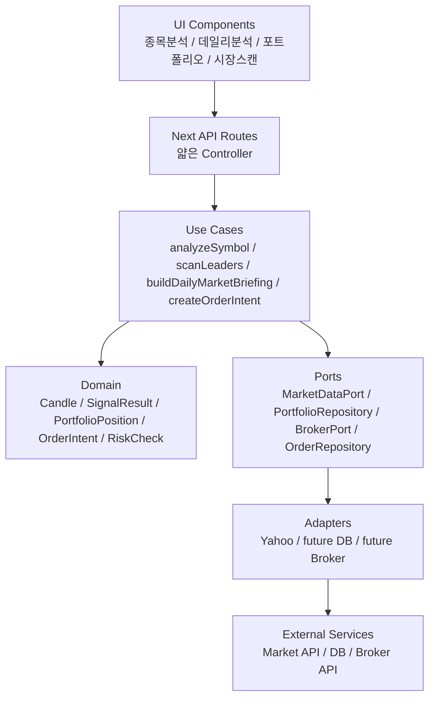
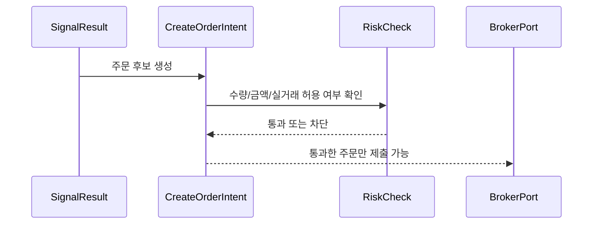

# 보안·서버 확장 대비 리팩토링 메모

## 목표

현재 앱은 Next.js 단일 앱을 유지하되, 회원가입, 서버 저장소, 증권사 API, 자동매매를 붙일 수 있도록 모듈형 모놀리스 경계를 먼저 둔다. 이번 리팩토링의 핵심은 API Route를 얇게 만들고, 분석·스캔·브리핑·주문 판단을 use-case 계층으로 이동시키는 것이다.

## 변경 후 구조



## 현재 구조

```text
src/domain
  market.ts
  portfolio.ts
  trading.ts
  user.ts
  strategy.ts
  execution.ts

src/ports
  market-data.ts
  portfolio-repository.ts
  order-repository.ts
  broker.ts
  notification.ts
  strategy-repository.ts
  execution-repository.ts

src/use-cases
  market/analyze-symbol.ts
  market/scan-leaders.ts
  briefing/build-daily-market-briefing.ts
  security/request-context.ts
  trading/create-order-intent.ts
  trading/risk-policy.ts
```

## 적용된 경계

- `src/app/api/market/[symbol]/route.ts`는 `analyzeSymbol` use-case를 호출하는 컨트롤러로 축소했다.
- `src/app/api/market/leaders/route.ts`는 `scanLeaders` use-case를 호출하는 컨트롤러로 축소했다.
- `src/app/api/briefing/daily-market/route.ts`는 `buildDailyMarketBriefing` use-case를 호출하는 컨트롤러로 축소했다.
- `src/domain/*`에 시장, 포트폴리오, 사용자, 주문 의도 타입을 추가했다.
- `src/ports/*`에 시세, 포트폴리오 저장소, 주문 저장소, 증권사, 알림 포트를 추가했다.
- `src/use-cases/trading/*`에 주문 의도 생성과 리스크 체크 흐름을 추가했다.
- 전략 저장/불러오기, 체결, 자동매매 로그 확장을 위해 `StrategyRepository`, `ExecutionRepository` 경계를 둔다.

## 향후 기능별 위치

- 회원가입/로그인: `src/domain/user`, `src/use-cases/security`
- 서버 포트폴리오 저장: `src/domain/portfolio`, `src/ports/portfolio-repository`
- 증권사 API: `src/ports/broker`, future `src/adapters/broker/*`
- 자동매매: `src/domain/trading`, `src/use-cases/trading`
- 전략 저장/불러오기: `src/domain/strategy`, `src/ports/strategy-repository`
- 체결/자동매매 로그: `src/domain/execution`, `src/ports/execution-repository`
- 분할투자/차수 관리: future `src/domain/split-trading`, future `src/use-cases/strategy`

## 자동매매 보안 원칙



- 신호 결과는 곧바로 증권사 주문으로 이어지지 않는다.
- 실거래는 기본 비활성화이며, `RiskPolicy.allowLiveTrading`이 명시적으로 켜져야 한다.
- 주문 후보는 `OrderIntent`로 기록 가능한 형태를 먼저 만들고, 추후 `OrderRepository`와 감사 로그에 연결한다.
- 증권사 API key, access token, refresh token은 브라우저 또는 localStorage에 둘 수 없다.

## 다음 리팩토링 순서

1. `analyzeSymbol` 내부의 지표 계산을 더 작은 strategy/use-case 함수로 분리한다.
2. `page.tsx`를 탭별 컴포넌트와 client hook으로 나눈다.
3. localStorage 포트폴리오를 `PortfolioRepository` adapter 뒤로 이동한다.
4. 인증 도입 시 `getRequestUserContext`를 실제 세션 기반 구현으로 교체한다.
5. 실거래 전에는 `BrokerPort` mock 또는 paper trading adapter를 먼저 붙인다.
6. 새 기능은 `docs/feature-extension-guide.md`의 순서대로 추가한다.
